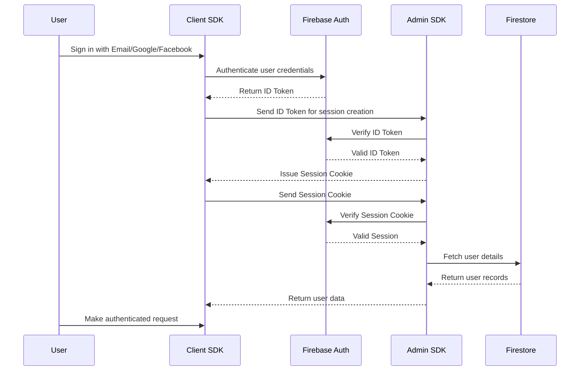

```mermaid
sequenceDiagram
    participant User
    participant ClientSDK as Client SDK
    participant FirebaseAuth as Firebase Auth
    participant AdminSDK as Admin SDK
    participant Firestore

    User->>ClientSDK: Sign in with Email/Google/Facebook
    ClientSDK->>FirebaseAuth: Authenticate user credentials
    FirebaseAuth-->>ClientSDK: Return ID Token
    ClientSDK->>AdminSDK: Send ID Token for session creation
    AdminSDK->>FirebaseAuth: Verify ID Token
    FirebaseAuth-->>AdminSDK: Valid ID Token
    AdminSDK-->>ClientSDK: Issue Session Cookie
    ClientSDK->>AdminSDK: Send Session Cookie
    AdminSDK->>FirebaseAuth: Verify Session Cookie
    FirebaseAuth-->>AdminSDK: Valid Session
    AdminSDK->>Firestore: Fetch user details
    Firestore-->>AdminSDK: Return user records
    AdminSDK-->>ClientSDK: Return user data
    User->>ClientSDK: Make authenticated request

```